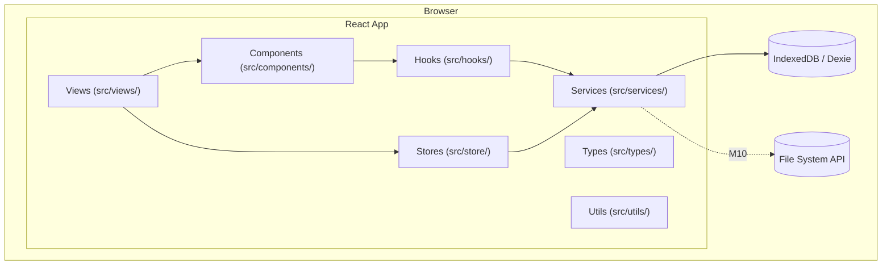
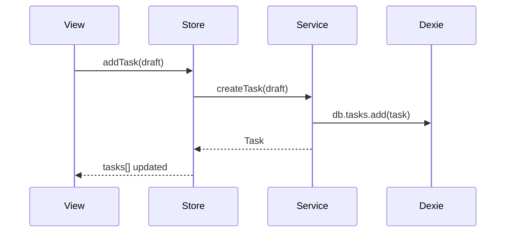

# TaskCycle Architecture

Updated each milestone. See `docs/taskcycle-plan.md` for the full roadmap.

## Layer Model

## Import Rules

- Services must not import React or hooks
- Components must not import services directly — go through hooks or stores
- Views own routing and layout; minimal logic beyond wiring

## Data Flow (M2+)

